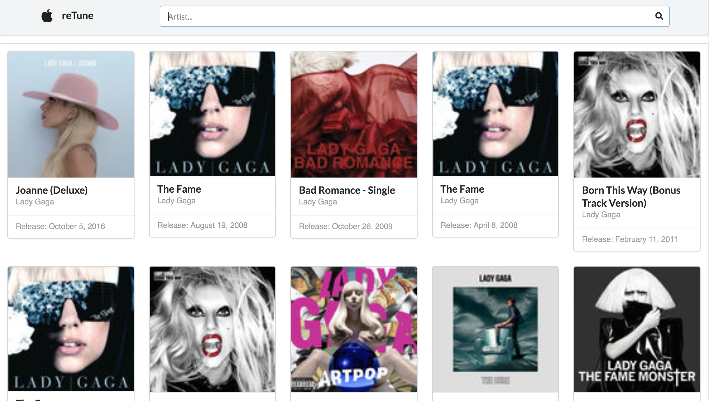

# reTune

### How this app works
    This is the application is built on React library that allows you to search for album from iTune APIs

### Libraries
* React
* Redux
* React-Router ^v.4
* Redux-Form

### Style
* Semantic-ui-react
* Semantic-ui

### To use this app

**Please click to start**
[Github page](https://kotchaparn-w.github.io/react_itune_album_search/)

 ***Let's take a look at todolists_redux***

